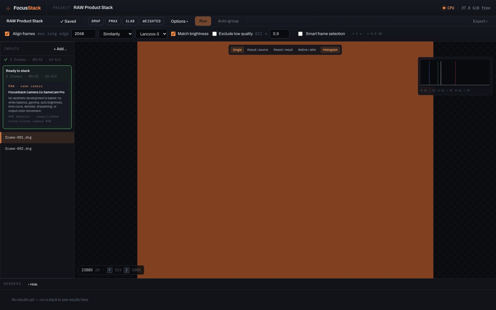
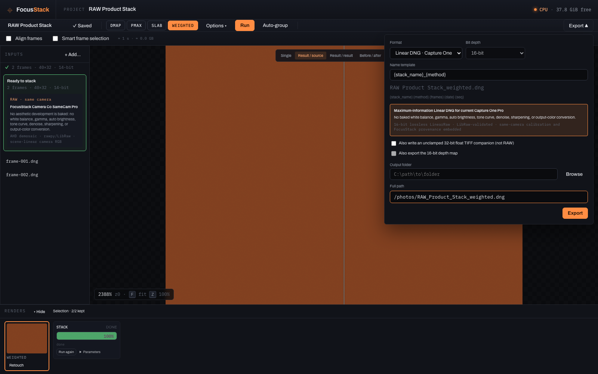
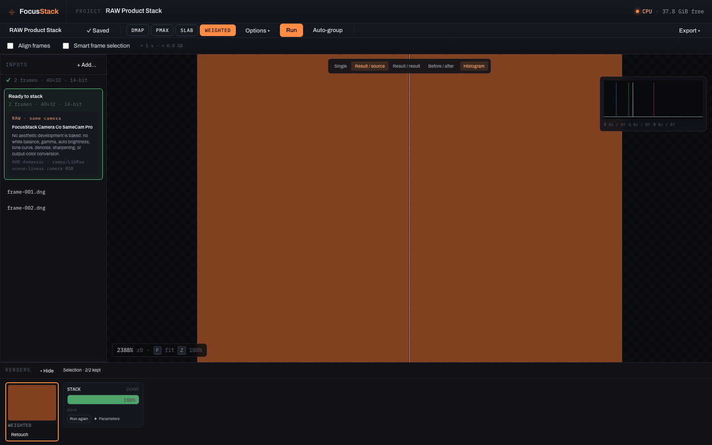

# PlaneFuse — Free, Open-Source Focus Stacking Software for macOS, Windows & Linux

**PlaneFuse is a free, open-source focus stacking app for macro, product, and
landscape photography — with a no-bake camera-RAW workflow that hands a real,
re-editable Linear DNG back to your raw developer instead of a baked-in
"look."**

Focus stacking merges a sequence of photos shot at different focus distances
into a single image with more sharp detail than any one frame holds on its
own. PlaneFuse does this entirely on your own machine — nothing is uploaded
anywhere — with GPU acceleration via CUDA (NVIDIA) or Apple MPS, and a plain
CPU fallback. It works with ordinary developed images (TIFF/JPEG/PNG) or, for
macro and product photographers who want full grading control afterwards,
directly with camera RAW files. If you're looking for a free, open-source
alternative to Helicon Focus or Zerene Stacker, this is what PlaneFuse was
built to be — see the [feature-by-feature comparison](#planefuse-vs-helicon-focus-vs-zerene-stacker-vs-shinestacker)
below.

[](https://github.com/AdrienLF/planefuse/actions/workflows/ci.yml)
[](LICENSE)



## Contents

- [Features](#features)
- [Installation (macOS, Windows, Linux & Docker)](#installation-macos-windows-linux--docker)
- [Focus stack RAW files without a baked-in look: the Linear DNG → Capture One workflow](#focus-stack-raw-files-without-a-baked-in-look-the-linear-dng--capture-one-workflow)
- [Documentation](#documentation)
- [What PlaneFuse intentionally doesn't do](#what-planefuse-intentionally-doesnt-do-and-why)
- [PlaneFuse vs Helicon Focus vs Zerene Stacker vs ShineStacker](#planefuse-vs-helicon-focus-vs-zerene-stacker-vs-shinestacker)
- [FAQ](#faq)
- [Verification status](#verification-status)
- [Security boundary](#security-boundary)
- [License](#license)

## Features

- **Four focus stacking methods**, selectable individually or run side by side
  for comparison in one click: **PMax** (pyramid/max-contrast, the
  general-purpose default), **DMap** (depth-map, smoother output, can also
  export a depth map), **Weighted average** (softmax blend, least halo-prone),
  and **Slab** (hierarchical sub-stacking for very deep macro sequences).
- **Image alignment** with translation, similarity, or perspective models,
  Lanczos-3/bicubic/bilinear warping, brightness matching, and a quality gate
  that can exclude low-correlation frames — plus an alignment review so you
  can see exactly what happened.
- **Smart frame selection and auto-grouping** to thin redundant frames out of
  a deep focus bracket and to batch-split one folder into several separate
  subjects, each reviewed before anything is queued.
- **Two processing domains:** ordinary developed images, or a **same-camera,
  no-bake RAW** pipeline that fuses in scene-linear camera RGB with no white
  balance, gamma, denoise, or sharpening baked in — see the
  [RAW workflow](#focus-stack-raw-files-without-a-baked-in-look-the-linear-dng--capture-one-workflow).
- **A deep-zoom local web workspace**: tiled pan/zoom on huge images, four
  compare modes (single, result/source split, result/result side-by-side,
  hold-to-view before/after), a live server-computed RGB/luminance histogram
  with per-channel clipping counts, and a job queue with reordering, cancel,
  and rerun.
- **Built-in retouching** — paint in pixels from any other source or result at
  full resolution, non-destructively (flatten produces a new result; the
  original is never modified).
- **Export** to 8/16-bit TIFF (none/LZW/ZIP), true 16-bit RGB PNG, 8-bit JPEG,
  or — for RAW results — a validated **Linear DNG**; plus optional unclamped
  32-bit float TIFF and 16-bit depth-map companions, and a token-based
  filename template (`{stack_name}_{method}_{seq}`, etc).
- **GPU acceleration** (NVIDIA CUDA / Apple MPS) with automatic tiled/CPU
  fallback on out-of-memory, and per-run time/memory estimates.
- **A CLI and a local HTTP + WebSocket API** for scripting and batch focus
  stacking, alongside the web UI — see [`docs/API.md`](docs/API.md).
- **Thorough in-app documentation.** Click **Help** in the top bar (or press
  `?` in the workspace) for a searchable guide written for photographers,
  covering shooting technique, every parameter, and troubleshooting — not just
  a developer README.

## Installation (macOS, Windows, Linux & Docker)

PlaneFuse runs entirely on your computer and opens its workspace automatically
in your browser at **`http://127.0.0.1:8425`**. Your photos are never uploaded.

### Guided setup (recommended)

Open the **[PlaneFuse installation assistant](https://adrienlf.github.io/planefuse/)**.
It detects macOS or Windows and walks through four visual steps: download,
extract, launch, and wait for the workspace to open.

- **Apple-silicon macOS 14+:** download the ready folder, extract it, then
  right-click `Launch PlaneFuse.command` and choose **Open**.
- **Windows 11 x64:** download the ready folder, extract it, then double-click
  `Launch PlaneFuse.bat`. A working NVIDIA GPU is selected automatically;
  otherwise PlaneFuse uses the CPU.

The ready folders contain the compiled interface and a small, official uv
executable. On first launch uv automatically downloads a private Python
environment and PlaneFuse's locked processing libraries. Photographers do not
install Node.js, uv, or Python themselves; Node.js is only used when the ready
folders are prepared for a release. The first launch can take 5–20 minutes and
later launches are much faster. The assistant downloads the latest `main`
build that passed Python, UI, Docker, macOS, Windows, and packaged-app smoke
tests; versioned releases remain available on GitHub.

### From source (developers)

The repository still includes `Launch PlaneFuse.command` and
`Launch PlaneFuse.bat`. A plain source checkout requires uv; Node.js is only
required when the compiled interface is absent.

```bash
uv sync --frozen --extra cpu --extra raw
cd ui && npm ci --no-fund && npm run build && cd ..
uv run --frozen --extra cpu --extra raw planefuse serve
```

On Apple silicon the macOS Torch wheel uses MPS automatically. On an
NVIDIA machine (Windows/Linux), sync with `--extra cu12x` instead of
`--extra cpu`. Drop `--extra raw` if you only ever stack already-developed
images and don't need camera-RAW support.

The launcher scripts run the same locked setup and are safe to call directly:

```text
scripts/start-macos.sh          # macOS, MPS-or-CPU
scripts\start-windows-cpu.bat   # Windows, CPU only
scripts\start-windows-gpu.bat   # Windows, NVIDIA GPU
```

### Docker

```bash
# GPU (requires nvidia-container-toolkit)
PLANEFUSE_PHOTOS=/path/to/your/photos docker compose up --build

# CPU only
docker build --target cpu -t planefuse:cpu .
docker run -p 127.0.0.1:8425:8425 \
  -v /path/to/your/photos:/photos:ro -v pf-data:/data planefuse:cpu
```

The container publishes to `127.0.0.1` only, by design — see
[Security boundary](#security-boundary).

### CLI

```bash
# Rendered images
uv run --frozen --extra cpu planefuse stack ./tiffs -o result.tif --method pmax --align

# No-bake RAW stack, exported as a validated Linear DNG for Capture One,
# plus the exact scene-linear float32 working values as a companion TIFF
uv run --frozen --extra cpu --extra raw planefuse stack ./raw-stack \
  -o result.dng --method pmax --align --float-tiff result-scene-linear-float.tif
```

RAW frames must all come from the same camera and sensor mode — see the
[RAW workflow](#focus-stack-raw-files-without-a-baked-in-look-the-linear-dng--capture-one-workflow).

## Focus stack RAW files without a baked-in look: the Linear DNG → Capture One workflow

Most focus stacking tools quietly develop your RAW files as part of stacking
and hand you back a finished, already-graded image. PlaneFuse does the
opposite on purpose: it decodes RAW frames with a fixed, minimal recipe — unit
white balance, linear gamma, no auto brightness, no denoise, no sharpening,
no output-colour conversion — fuses them in the camera's own scene-linear
RGB, and exports a **16-bit, lossless, LibRaw-validated Linear DNG** that a
real raw developer opens and grades exactly like any other RAW capture. You
keep every white-balance, exposure, tone, colour, and sharpening decision,
made on the *merged, in-focus* image instead of inherited from PlaneFuse.

The only irreversible step is AHD demosaicing, which stacking fundamentally
requires (alignment and fusion combine full-colour samples from different
focal planes — a still-mosaiced file can't support that). Every RAW frame in
one stack must share camera, sensor mode, and calibration, because a stacked
image can only honestly carry one set of DNG metadata.

Full detail, including the Capture One import checklist and the file's exact
provenance/verification guarantees: [`docs/RAW_DNG_CAPTURE_ONE.md`](docs/RAW_DNG_CAPTURE_ONE.md).



## Documentation

- **In-app Help** — click **Help** in the top bar, or press `?` in the
  workspace, for a searchable guide written for photographers: shooting
  technique, every method/parameter explained practically and technically,
  and troubleshooting.
- [Installation](docs/INSTALL.md)
- [User guide](docs/USER_GUIDE.md)
- [RAW and Capture One workflow](docs/RAW_DNG_CAPTURE_ONE.md)
- [Architecture](docs/ARCHITECTURE.md)
- [API](docs/API.md)
- [Troubleshooting](docs/TROUBLESHOOTING.md)
- [Performance](docs/PERFORMANCE.md)
- [Continuous integration and releases](docs/CI.md)
- [Release checklist](docs/RELEASE_CHECKLIST.md)
- [Implementation specification](docs/SPEC.md)



## What PlaneFuse intentionally doesn't do, and why

- **No baked photographic look on RAW stacks.** PlaneFuse could apply white
  balance, a tone curve, and sharpening like most stacking tools do — it
  deliberately doesn't, so the Linear DNG stays a real, fully re-editable RAW
  file instead of a finished rendering you'd have to fight to re-grade.
- **No mixed-camera or mixed-calibration RAW stacks.** A stacked image can
  only carry one honest set of DNG metadata; blending frames from different
  bodies or sensor modes would mean the file lies about at least one source
  frame. Rendered-image stacks have no such restriction.
- **No re-created sensor mosaic.** A stack's pixels come from several
  captures and geometric transforms, so there is no real single Bayer pattern
  it could claim to be — the DNG output is a demosaiced LinearRaw file, not a
  simulated original RAW.
- **No camera tethering or capture control.** PlaneFuse is a post-processing
  tool only; it doesn't talk to your camera. That keeps its scope, and its
  attack surface, deliberately small.
- **No panorama stitching.** Some competitors combine stacking with
  micro-panorama tools; PlaneFuse stays a focus stacking (and retouching)
  tool by design rather than growing into a general compositing suite.
- **No cloud processing, accounts, or mobile app.** Everything runs on your
  machine and binds to `127.0.0.1` only — your photos never leave your
  computer, and there's nothing to log into.
- **No frozen native installer.** PlaneFuse ships as an inspectable ready
  folder with a visual setup guide instead of a `.dmg`/`.exe` application
  bundle. The first launch downloads its locked Python environment, while later
  launches reuse it.

## PlaneFuse vs Helicon Focus vs Zerene Stacker vs ShineStacker

A fair, feature-level comparison against three other focus stacking tools,
current as of mid-2026. Pricing and feature tiers change — check each
vendor's site for the latest.

| | **PlaneFuse** | [Zerene Stacker](https://zerenesystems.com/) | [Helicon Focus](https://www.heliconsoft.com/) | [ShineStacker](https://github.com/lucalista/shinestacker) |
|---|---|---|---|---|
| **License / price** | Free, open source (MIT) | Commercial — $89 Personal, higher Professional tier | Commercial — tiered, roughly $30–65/yr or $115–240 lifetime by tier | Free, open source (LGPL-3.0) |
| **Source code** | Fully open | Closed | Closed | Fully open |
| **Interface** | Local browser workspace with guided ready-folder setup | Native desktop app (Java) | Native desktop app | Native desktop app (Qt6) |
| **Platforms** | macOS, Windows, Linux (Docker) | Windows, macOS (universal), Linux | Windows, macOS | Windows, macOS, Linux |
| **Stacking methods** | PMax, DMap, Weighted average, Slab (hierarchical) | PMax, DMap | Method A (weighted avg), B (depth map), C (pyramid) | Configurable alignment/normalize/blend pipeline |
| **GPU acceleration** | Yes — CUDA and Apple MPS, with CPU fallback | Not published | Not published | Not published |
| **RAW handling** | No-bake: fuses scene-linear camera RGB, exports a re-editable Linear DNG | Renders RAW internally to a finished image | Stacks RAW directly, renders internally to a finished image | Reads RAW via `rawpy`, renders internally to a finished image |
| **Retouching** | Built-in, non-destructive session + flatten | Built-in brush | Built-in brush | Built-in retouch editor |
| **Large/batch stacks** | Smart frame selection, auto-grouping, Slab method | Batch processing | Batch processing | Batch processing, scriptable pipeline |
| **Automation** | CLI + local HTTP/WebSocket API | GUI batch scripting | GUI batch scripting, Helicon Remote | Python API + Jupyter |
| **Camera tethering / panorama** | No — stacking only | No | Yes — Helicon Remote (Pro+), micro-panorama stitching | No |

PlaneFuse and ShineStacker are the two open-source focus stacking options
here, and the closest in spirit; the practical differences are PlaneFuse's
GPU acceleration, its no-bake same-camera RAW pipeline built specifically for
a Linear-DNG round trip into a raw developer, and its browser-based UI versus
ShineStacker's native Qt desktop app and Python-first workflow. Zerene
Stacker and Helicon Focus are the long-established commercial tools; both are
mature, well-documented, and — being closed source — impossible to verify or
extend yourself, which is the trade-off PlaneFuse and ShineStacker exist to
avoid.

## FAQ

**Is PlaneFuse really free?**
Yes. PlaneFuse is MIT-licensed, free for personal and commercial use, with no
tiers, trials, accounts, or telemetry. The full source code is in this
repository.

**Is there a free alternative to Helicon Focus or Zerene Stacker?**
PlaneFuse and ShineStacker are the two actively developed open-source focus
stacking tools; the [comparison table](#planefuse-vs-helicon-focus-vs-zerene-stacker-vs-shinestacker)
above sets out honestly where each one is stronger.

**Can I focus stack RAW files?**
Yes — and unlike most stacking software, PlaneFuse doesn't develop them into
a finished look. It fuses in scene-linear camera RGB and exports a re-editable
Linear DNG you grade in Capture One or any raw developer. All frames in one
RAW stack must come from the same camera and sensor mode; the only
irreversible step is demosaicing, which stacking inherently requires.

**Does it run on Apple Silicon Macs?**
Yes. On Apple silicon, PlaneFuse uses the GPU via Metal (MPS) automatically;
on NVIDIA machines it uses CUDA; everywhere else it falls back to CPU, with
automatic tiled processing if GPU memory runs out.

**Are my photos uploaded anywhere?**
No. PlaneFuse runs entirely on your machine and binds to `127.0.0.1` only.
Source photos are read in place and never modified or deleted.

**How many photos do I need for a focus stack?**
It depends on magnification and aperture: a landscape may need 3–5 frames,
while extreme macro can take 50–200+. PlaneFuse's smart frame selection can
thin redundant frames from deep brackets, and the Slab method is built for
very deep sequences. The in-app Help covers shooting technique in detail.

## Verification status

As of 2026-07-15: the complete Python suite, static checks, production UI
build, CPU browser workflows, and a targeted MPS RAW→DNG browser workflow
pass. The DNG is reopened by tifffile and LibRaw and pixel-checked before
atomic publication. CUDA hardware and manual import in the current Capture
One Pro 16.7.5 remain explicit release-machine gates; see the
[release checklist](docs/RELEASE_CHECKLIST.md).

## Security boundary

The app has no authentication because it binds to `127.0.0.1` only. Docker
also publishes `127.0.0.1:8425:8425`; do not change this to a LAN-wide
binding. Source photos are used in place and are never deleted by project
removal.

## License

PlaneFuse is released under the [MIT License](LICENSE) — free for personal
and commercial use, modification, and redistribution.
